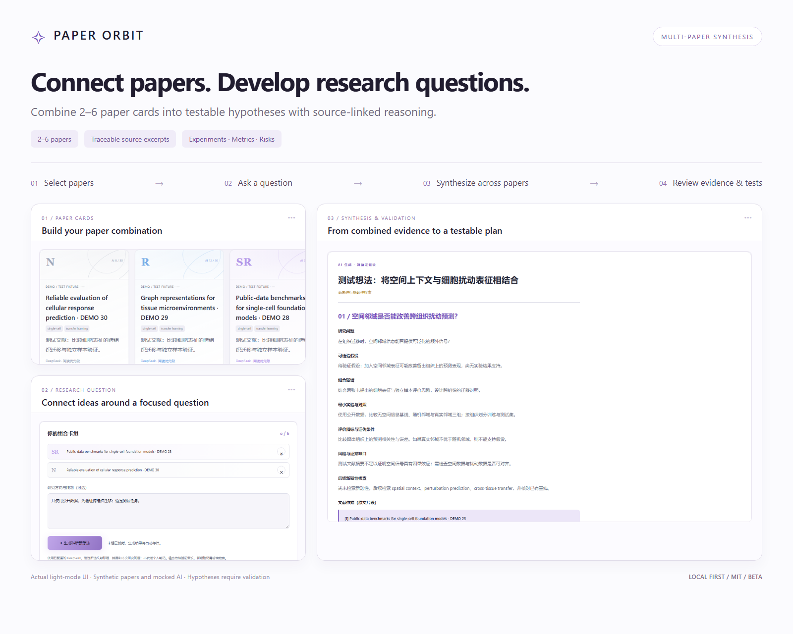
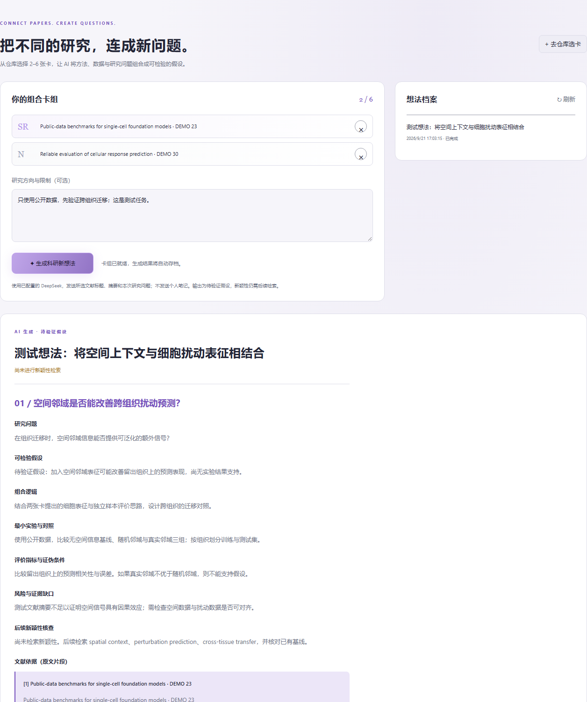
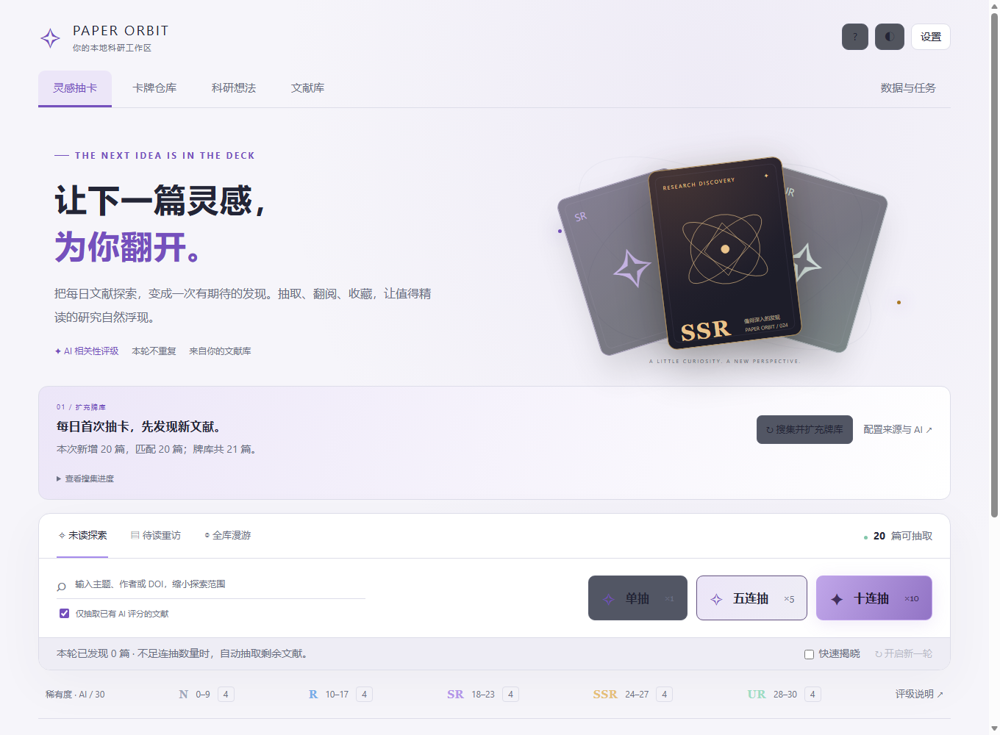
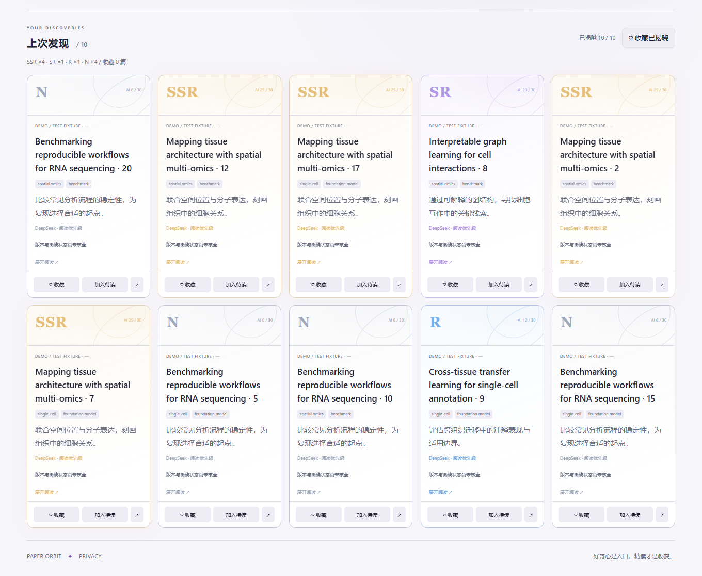
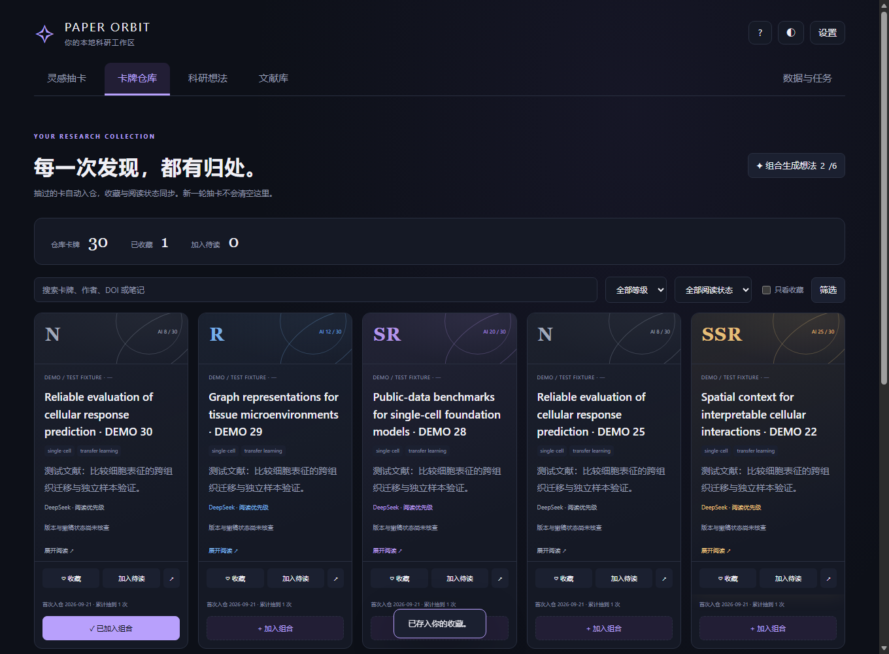
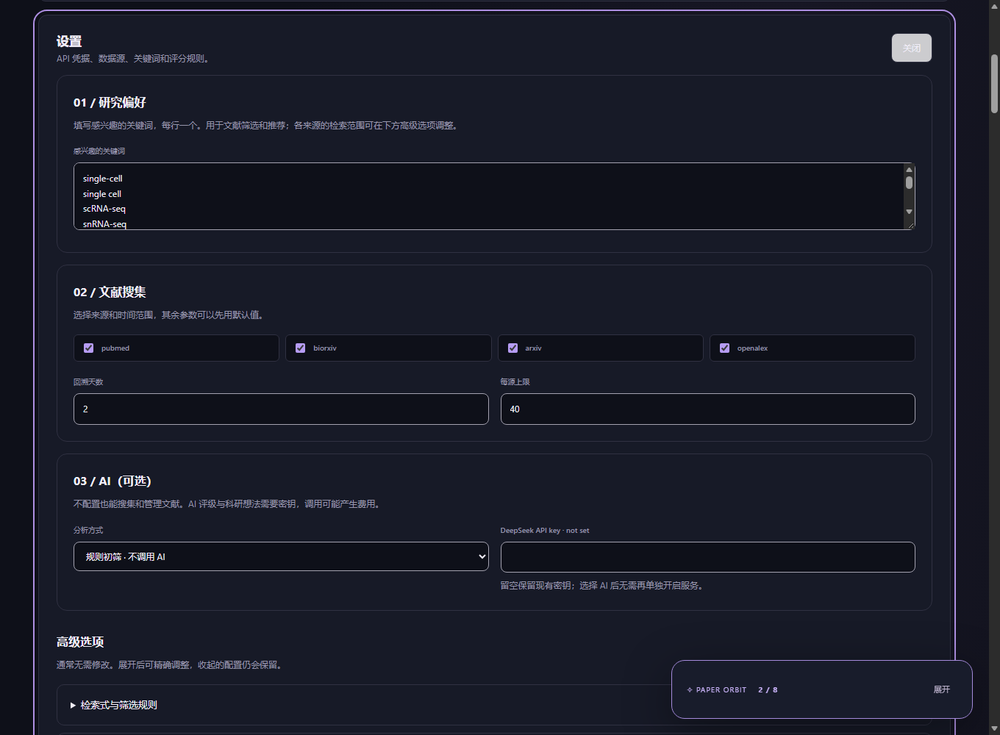

<div align="center">

# ✧ Paper Orbit

**Multi-paper synthesis: connect literature to testable research hypotheses.**

[简体中文](README.md) · **English**

A local research workspace for Windows · MIT · Beta

**[Download for Windows](https://github.com/fushan-emd/paper-orbit/releases/download/v0.4.0-beta.3/PaperOrbit-0.4.0-beta.3-Setup.exe)** · [Release notes](https://github.com/fushan-emd/paper-orbit/releases/tag/v0.4.0-beta.3)

[Multi-paper synthesis](#multi-paper-synthesis) · [Quick start](#quick-start) · [Product tour](#product-tour) · [Data and privacy](#data-and-privacy)

</div>



> **About the screenshots:** All screenshots come from isolated test environments with synthetic papers and mocked AI responses. Titles, ratings and research content illustrate the interface; they are not scientific findings or verified publications. The screenshots do not use the author's private library. The interface shown here is in Chinese.

## Multi-paper synthesis

**Bring 2–6 papers together around one research question and explore how their ideas might connect.**

Select papers from your warehouse and ask AI to analyze their methods, tasks and evidence together, producing **1–2 hypotheses to test**. Card draws help you discover material; synthesis helps you consider what to investigate next.

| Your input | How the workbench structures the output |
| --- | --- |
| 2–6 paper cards | A rationale for combining papers, with source excerpts from at least two input papers for each hypothesis |
| A focused research question | A testable hypothesis and an explanation of how the papers contribute |
| Optional resource or experimental constraints | A minimal experiment, baselines and controls, evaluation metrics, and potential falsification criteria |

### From selection to a validation plan

1. **Select:** Choose 2–6 papers across warehouse pages and open the idea lab.
2. **Ask:** Describe your question and constraints, such as public datasets only or a low-cost initial experiment.
3. **Synthesize:** Generate a combination rationale, hypothesis, experimental plan, evaluation criteria, risks and novelty-search directions.
4. **Check:** Compare the reasoning with the supplied source excerpts, then consult the original papers.



Outputs include **the research question, a testable hypothesis, combination rationale, minimal experiment and controls, evaluation and falsification criteria, risks and evidence gaps, follow-up novelty searches, and source excerpts**. Selection drafts and generation history stay in your local workspace.

> **Evidence boundary:** Synthesis uses the selected papers' titles and abstracts. Previous AI summaries and scores are not treated as scientific evidence. The application checks source IDs, excerpt matches and cross-paper source requirements. It does not verify that an excerpt semantically supports a claim, replace full-text review, establish experimental validity or confirm novelty.

## Why Paper Orbit?

A growing reading list does not always make it easier to start reading or identify the next research question. Paper Orbit connects literature collection, card-based browsing, reading management and multi-paper synthesis in one local workspace: **discover material → read closely → connect ideas → formulate testable questions**.

There are currently no cloud accounts or synchronization services. AI features use your own provider configuration.

## Product tour

### 1. Collect papers, then draw a new perspective



- Collect from PubMed, bioRxiv, arXiv and OpenAlex. The default profile targets bioinformatics; keywords and source queries are configurable.
- Draw **one, five or ten cards** with equal probability across eligible papers and no repeats within a round.
- If fewer papers remain, the draw returns what is available. There is no artificial guaranteed-rarity mechanism.
- Rare cards have reveal effects, with quick-reveal and reduced-motion support.



| Tier | AI score / 30 | Meaning |
| --- | --- | --- |
| N | 0–9 | Reading-priority band |
| R | 10–17 | Reading-priority band |
| SR | 18–23 | Reading-priority band |
| SSR | 24–27 | Reading-priority band |
| UR | 28–30 | Reading-priority band |

**Ratings express reading priority for your research interests, not authenticity, scientific quality or journal prestige.** Papers with only rule-based analysis, failed AI analysis or no valid AI score are marked unrated. Analysis primarily uses titles and abstracts.

### 2. Keep discoveries in your warehouse

Drawn cards remain in your warehouse. Favorite papers, filter the collection, track reading status and select cards across pages. The library also supports search, paper details and private reading notes.



Combine your selected cards in the idea lab and revisit saved drafts and generation history as your question develops.

### 3. Start with simple settings

Basic settings cover research interests, collection sources and limits, and optional AI. Queries, model parameters, journals and credential management live in expandable advanced sections.



A guided tour follows you through settings, collection, draws, the warehouse, the idea lab, the library and data management. Collapse it, go back, skip it or restart it; saving settings and refreshing do not end the tour.

### 4. Manage data and background tasks

- Back up and restore the SQLite database, or export papers as JSON. Restoration first backs up the current database.
- Inspect collection and generation tasks and cancel subsequent work.
- Review AI request counts and provider-reported token usage, with local daily budget protection.
- Navigate consistently between all main pages; settings, theme and help remain in the tool area.

## Quick start

### Install on Windows (recommended)

**[Download Paper Orbit v0.4.0-beta.3](https://github.com/fushan-emd/paper-orbit/releases/download/v0.4.0-beta.3/PaperOrbit-0.4.0-beta.3-Setup.exe)** · [Release notes and SHA-256 checksum](https://github.com/fushan-emd/paper-orbit/releases/tag/v0.4.0-beta.3)

1. Download and run the installer. A separate Python installation is not required.
2. Open Paper Orbit from the Start menu and follow the guide to configure your research interests and sources.
3. If WebView2 is missing, install Microsoft's [WebView2 Runtime](https://developer.microsoft.com/en-us/microsoft-edge/webview2/) and restart the app.

For Windows x64. The installer is currently unsigned; download it from this repository's Releases and verify the SHA-256 checksum if needed. No personal literature database or API keys are bundled. Uninstalling preserves the separate user workspace.

### Run from source

The primary platform is **Windows**, with **Python 3.13** used for development and validation. The desktop window uses WebView2; local browser mode is also available.

```powershell
git clone https://github.com/fushan-emd/paper-orbit.git
cd paper-orbit
python -m venv .venv
.venv\Scripts\python.exe -m pip install -r requirements-runtime.lock
.venv\Scripts\python.exe desktop_app.py
```

The first launch creates local configuration from `installer/config.toml`. No API keys are included.

**Suggested first session:**

1. Follow the guide to review research keywords, sources and queries.
2. Choose rule-based screening to collect and manage papers without AI.
3. If no papers have AI ratings, disable the AI-only filter on the discovery page.
4. Draw cards, save interesting papers and read the original sources.
5. Add your own provider credentials when you want AI analysis or multi-paper synthesis. Calls may incur charges.

For an isolated browser workspace, run this from a new PowerShell process:

```powershell
powershell -NoProfile -ExecutionPolicy Bypass -File scripts/start_clean_workspace.ps1
```

It uses port **8010** by default and the Git-ignored `private-preview/` directory, without inheriting common AI/source API-key environment variables. Later launches retain that isolated workspace's own data.

## Data and privacy

| Content | Location or processing |
| --- | --- |
| Papers, favorites, notes, warehouse and idea history | Local workspace database |
| Saved API keys | Windows Credential Manager, namespaced by workspace |
| Default source-mode workspace | The source directory |
| Default installed-app workspace | `%LOCALAPPDATA%/PaperOrbit` |
| AI paper analysis | Necessary paper information, including titles and abstracts, is sent to the configured provider |
| AI research ideas | Selected paper information and your question are sent; private reading notes are not |

Set `LITERATURE_RADAR_ROOT` to select an independent workspace. A newly specified directory starts from defaults without automatically importing an old workspace.

Cancellation cannot recall requests already sent and may still incur costs. Restoring a database does not overwrite settings, credentials or the usage ledger. See [PRIVACY.md](PRIVACY.md) for the detailed policy, currently in Chinese.

## Development and validation

```powershell
# Unit and integration checks: synthetic data, no live AI calls
.venv\Scripts\python.exe -m unittest discover -s tests -p "test_*.py"

# Browser checks also need local Edge/Chrome and Node.js 22+
.venv\Scripts\python.exe tests/browser_check.py
.venv\Scripts\python.exe tests/browser_discovery.py
.venv\Scripts\python.exe tests/browser_workbench.py
```

Release preparation included 53 tests, three browser workflow suites and startup with an isolated empty workspace. Browser collection and AI responses are mocked; these checks do not establish real-model content quality or comprehensive platform compatibility.

Build instructions: [DESKTOP_APP.md](DESKTOP_APP.md). Private/public source separation: [PUBLIC_RELEASE.md](PUBLIC_RELEASE.md). These supporting documents are currently in Chinese. The allowlist export entry point is `scripts/prepare_public_release.py`.

## Status and known limitations

This project provides **Beta source code and a Windows x64 installer**. The current installer is **v0.4.0-beta.3**; later changes on main may precede the next installer release.

- Windows is the primary validation target; clean systems, missing WebView2, accessibility and other compatibility cases need independent testing.
- No cloud sync or team collaboration. Running tasks do not automatically resume after exit.
- External sources can be unavailable or rate-limited; anonymous OpenAlex access has returned HTTP 429.
- Live AI integration and independent human content review remain incomplete. Verify sources, evidence and feasibility.
- Existing installer builds are unsigned. The management page is not fully localized into English.

Report reproducible problems through [Issues](https://github.com/fushan-emd/paper-orbit/issues), including your environment, steps and error type. **Do not attach API keys, private research questions, notes or a complete personal database.**

## License

Project code is available under the [MIT License](LICENSE). See [THIRD_PARTY_NOTICES.md](THIRD_PARTY_NOTICES.md) for dependencies. MIT does not grant redistribution rights to third-party papers, abstracts, trademarks or user content.
