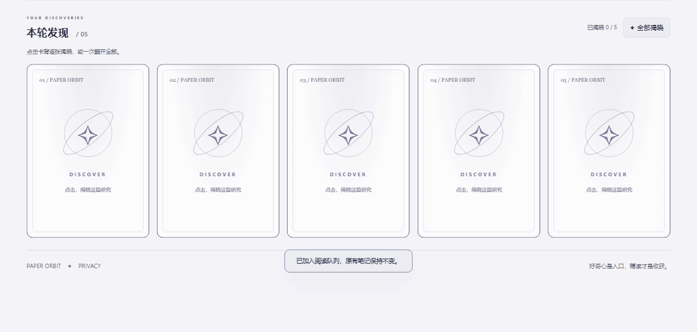

<div align="center">

# ✧ Paper Orbit

**让文献阅读多一点发现：搜集、抽卡、收藏，连接研究灵感。**

**简体中文** · [English](README.en.md)

Windows 本地科研工作区 · MIT 开源 · Beta

**[下载 Windows 安装包](https://github.com/fushan-emd/paper-orbit/releases/download/v0.4.0-beta.3/PaperOrbit-0.4.0-beta.3-Setup.exe)** · [版本说明](https://github.com/fushan-emd/paper-orbit/releases/tag/v0.4.0-beta.3)

[功能预览](#功能预览) · [快速开始](#快速开始) · [多卡片汇聚分析](#多卡片汇聚分析) · [数据与隐私](#数据与隐私) · [开发与验证](#开发与验证)

</div>


> **截图说明：** 本页所有界面截图均来自隔离测试环境，使用合成文献及模拟 AI 响应，仅展示交互。示例标题、评分和研究内容不应视为真实论文或科学结论；没有使用作者的私人文献库。

## 为什么做 Paper Orbit

论文越存越多，却不一定更容易开始阅读或找到下一步研究问题。Paper Orbit 把文献搜集、抽卡浏览、阅读管理与多卡片汇聚放在同一个本地工作区：**发现材料 → 深入阅读 → 组合线索 → 提出可验证的问题**。

它运行在自己电脑上。目前没有云端账户或同步服务，AI 功能使用你自己的服务商配置。

## 功能预览

### 1. 先搜集文献，再抽一组灵感

- 接入 PubMed、bioRxiv、arXiv、OpenAlex；默认方向为生物信息学，可修改关键词与检索式。
- 支持 **单抽、五连抽、十连抽**，在符合条件的文献池中等概率抽取，同一轮不重复。
- 可用文献不足时返回剩余卡片；没有虚构的保底机制。
- 稀有卡带揭晓特效，支持快速揭晓与系统减少动画偏好。

**翻卡动态演示 · 五连抽**



*实际界面录制，使用合成演示文献；动图循环播放。*


| 等级 | AI 分数 / 30 | 如何理解 |
| --- | --- | --- |
| N | 0–9 | 阅读优先级分档 |
| R | 10–17 | 阅读优先级分档 |
| SR | 18–23 | 阅读优先级分档 |
| SSR | 24–27 | 阅读优先级分档 |
| UR | 28–30 | 阅读优先级分档 |

**评级表示对当前研究方向的阅读优先级，不是真实性、科学质量或期刊级别认证。** 仅有规则分析、AI 失败或无有效 AI 评分的文献显示为待评级。分析主要基于标题和摘要。

### 2. 抽到的卡，进入自己的仓库

卡牌仓库保留抽取记录，支持收藏、筛选、阅读状态管理，以及跨页选择组合卡组。文献库同时提供全部搜集结果的搜索、详情阅读与私人笔记。


选择 **2–6 张卡**，输入具体研究问题，可在科研想法工作台生成带来源片段的待验证假设，并保留卡组草稿和生成历史。程序会验证引用 ID 和片段是否来自输入材料，但不能替代对证据语义、实验可行性和新颖性的人工判断。

<a id="多卡片汇聚分析"></a>

### 3. 多卡片汇聚分析

**把 2–6 篇文献放在同一个研究问题下，探索它们可以如何组合。**

你可以从仓库中选择关注的论文，把不同文献中的方法、任务和证据线索交给 AI 联合分析，形成 **1–2 个待验证的研究假设**。抽卡帮助发现材料，汇聚分析则帮助你从“读过几篇论文”走向“下一步可以验证什么”。

| 你提供 | 工作台如何组织输出 |
| --- | --- |
| 2–6 张文献卡 | 说明跨文献的组合依据，每个假设关联至少两篇输入文献的来源片段 |
| 一个具体研究问题 | 围绕问题提出可检验假设，解释各篇文献如何参与组合 |
| 可选的资源与实验约束 | 提出最小实验、基线与对照、评价指标及可能推翻假设的结果 |

#### 从选卡到验证思路

1. **选卡**：在仓库跨页勾选 2–6 篇论文，进入科研想法工作台。
2. **提问**：描述想解决的问题，也可补充“只使用公开数据”“先做低成本验证”等约束。
3. **汇聚分析**：生成组合依据、待验证假设、实验设计、评价方式、风险和后续查新方向。
4. **回看证据**：对照原始来源片段检查推断，再回到论文原文确认。


输出包含 **研究问题 · 可检验假设 · 组合依据 · 最小实验与对照 · 评价指标与证伪条件 · 风险与证据缺口 · 后续查新检索 · 来源片段**。卡组草稿和生成历史会保留在本地，便于后续回看与调整。

> **证据边界：** 分析基于所选文献的标题和摘要，不把先前 AI 总结或评分当作科学证据。程序检查引用 ID、片段匹配和跨文献来源约束；不保证片段在语义上支持推断，也不代表已完成全文综述、实验验证或创新性检索。

### 4. 配置尽量简单，细节按需展开

基础设置只展示研究偏好、文献来源与范围、AI 配置。检索式、模型参数、期刊与密钥管理放在高级选项中。


首次使用有跨页面教程，跟随设置、搜集、抽卡、仓库、科研想法、文献库与数据管理。可以收起、返回、跳过或重新开始；保存设置和刷新不会结束教程。

### 5. 数据和任务有独立管理入口

- SQLite 数据库备份、恢复和 JSON 导出；恢复前先备份当前数据。
- 查看后台搜集与生成任务，主动取消后续处理。
- 查看 AI 请求次数与服务返回的 token 用量，使用本机每日预算保护。
- 所有页面共享主导航，设置、主题和教程位于工具区。

## 快速开始

### Windows 下载安装（推荐）

**[下载 Paper Orbit v0.4.0-beta.3 安装包](https://github.com/fushan-emd/paper-orbit/releases/download/v0.4.0-beta.3/PaperOrbit-0.4.0-beta.3-Setup.exe)** · [版本说明与 SHA-256 校验文件](https://github.com/fushan-emd/paper-orbit/releases/tag/v0.4.0-beta.3)

1. 下载并运行安装程序，按提示完成安装；无需单独安装 Python。
2. 从开始菜单打开 Paper Orbit，跟随教程检查研究方向与文献来源。
3. 如提示缺少 WebView2，请安装微软官方 [WebView2 Runtime](https://developer.microsoft.com/en-us/microsoft-edge/webview2/)，然后重启应用。

适用于 Windows x64，当前安装包未代码签名。请从本仓库 Release 下载并按需核对 SHA-256。程序不附带个人文献库或 API 密钥；卸载会保留独立用户工作区。

### 从源码运行

当前主要支持 **Windows**，开发验证环境为 **Python 3.13**。桌面窗口使用 WebView2；也可用本地浏览器打开。

```powershell
git clone https://github.com/fushan-emd/paper-orbit.git
cd paper-orbit
python -m venv .venv
.venv\Scripts\python.exe -m pip install -r requirements-runtime.lock
.venv\Scripts\python.exe desktop_app.py
```

首次启动会从 `installer/config.toml` 创建本地配置，不包含任何 API 密钥。

**第一次使用建议：**

1. 跟随教程检查研究关键词、文献来源和检索范围。
2. 暂不使用 AI 时选择“规则初筛”，先完成文献搜集。
3. 无 AI 评分文献时，取消抽卡页的“仅抽取已有 AI 评分的文献”筛选。
4. 抽取卡片，收藏感兴趣的论文，再打开原文深入阅读。
5. 需要 AI 解读和科研想法时，在设置中填写自己的服务凭据。调用可能产生费用。

希望在完全独立的工作区试用时，在新的 PowerShell 进程中运行：

```powershell
powershell -NoProfile -ExecutionPolicy Bypass -File scripts/start_clean_workspace.ps1
```

这会以本地浏览器模式启动，默认端口 **8010**，使用仓库内被 Git 忽略的 `private-preview/`，不继承常见 AI/文献源环境变量密钥。再次启动会保留这个独立工作区自己的数据。

## 数据与隐私

| 内容 | 保存或处理位置 |
| --- | --- |
| 文献、收藏、笔记、仓库、想法历史 | 本机工作区数据库 |
| 保存的 API 密钥 | Windows 凭据管理器，按工作区区分 |
| 源码模式默认工作区 | 当前源码目录 |
| 安装版默认工作区 | `%LOCALAPPDATA%/PaperOrbit` |
| AI 文献分析 | 向所配置服务发送必要的文献标题、摘要等信息 |
| AI 科研想法 | 发送所选文献信息与研究问题；不发送个人阅读笔记 |

通过 `LITERATURE_RADAR_ROOT` 可指定独立工作区。显式指定的新目录从默认模板开始，不自动导入原工作区数据。

取消任务不能撤回已经发送的网络请求，可能仍产生费用。数据库恢复不覆盖配置、凭据或用量账本。详细说明见 [PRIVACY.md](PRIVACY.md)。

## 开发与验证

```powershell
# 单元与集成测试：合成数据，不调用真实 AI
.venv\Scripts\python.exe -m unittest discover -s tests -p "test_*.py"

# 浏览器回归：还需要本机 Edge/Chrome 和 Node.js 22+
.venv\Scripts\python.exe tests/browser_check.py
.venv\Scripts\python.exe tests/browser_discovery.py
.venv\Scripts\python.exe tests/browser_workbench.py
```

发布前验证包括 53 项测试、三组浏览器主流程回归，以及独立空白工作区启动。浏览器测试中的采集和模型使用模拟服务；这些结果不等同于真实 AI 内容质量或全平台兼容性验收。

构建说明见 [DESKTOP_APP.md](DESKTOP_APP.md)。私人开发目录与公开源码的隔离流程见 [PUBLIC_RELEASE.md](PUBLIC_RELEASE.md)，白名单导出入口为 `scripts/prepare_public_release.py`。

## 当前状态与已知限制

本仓库提供 **Beta 源码与 Windows x64 安装包**。当前安装版为 **v0.4.0-beta.3**，后续 main 分支的源码可能先于下一次安装包发布。

- 当前主要验证 Windows；干净系统、WebView2 缺失、辅助功能等仍需独立验收。
- 无云同步和团队协作；关闭软件后，正在执行的任务不自动续跑。
- 外部文献源可能限流或暂时不可用，OpenAlex 匿名访问曾遇到 429。
- 真实 AI 联调及独立人工内容评审仍需补齐；输出需要核对来源、证据和可行性。
- 现有安装构建未代码签名，管理页尚未完整英文化。

欢迎通过 [Issues](https://github.com/fushan-emd/paper-orbit/issues) 反馈可复现的问题。请提供系统环境、操作步骤与错误类型，**不要上传 API 密钥、私人研究问题、笔记或完整私人数据库**。

## 许可

本项目代码使用 [MIT License](LICENSE)。第三方组件的许可见 [THIRD_PARTY_NOTICES.md](THIRD_PARTY_NOTICES.md)。MIT 不授予第三方论文、摘要、商标或用户内容的再分发权利。
